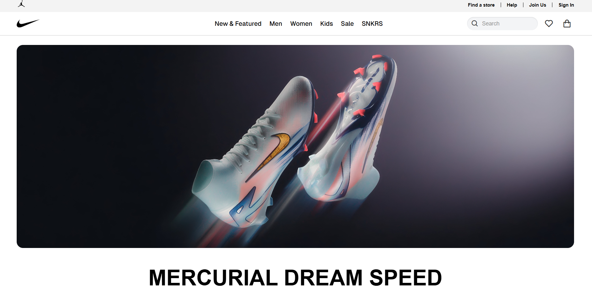
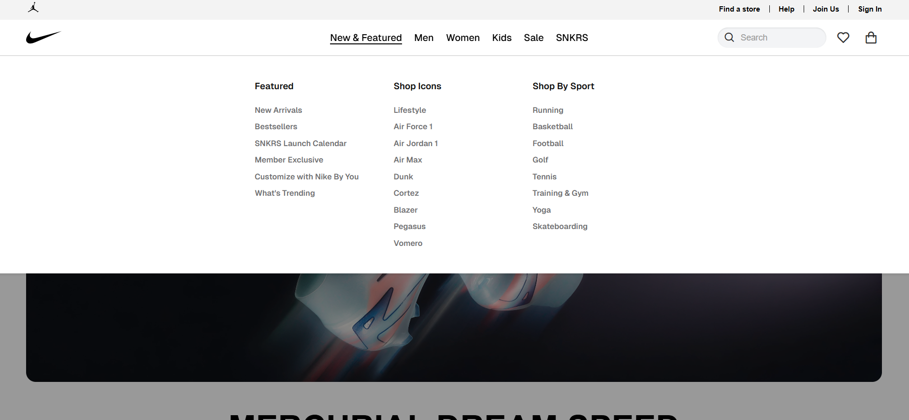

# Nike Website Clone

A responsive clone of the Nike official website built with HTML, CSS, and JavaScript.


## Project Overview

This project is a frontend implementation of the Nike website, featuring a responsive design that adapts to different screen sizes (desktop and mobile). The website includes various sections such as product showcases, navigation menus, and a footer with links to different Nike resources.

## Features

- Responsive design that adapts to desktop and mobile views
- Dynamic header with scroll behaviors
- Product showcases with interactive elements
- Footer with Nike resources, help links, and company information
- Back-to-top functionality for easy navigation
- Component-based architecture for better code organization
- Mobile-friendly navigation menu

## Project Structure

```
nike-app-clone/
├── index.html            # Main HTML file
├── README.md             # Project documentation
├── assets/
│   ├── css/
│   │   ├── style.css          # Main stylesheet
│   │   ├── mobile-menu.css    # Mobile menu styles
│   │   ├── footer.css         # Footer-specific styles
│   │   └── back-to-top.css    # Back-to-top button styles
│   ├── js/
│   │   ├── script.js          # Main JavaScript file
│   │   ├── mobile-menu.js     # Mobile menu functionality
│   │   ├── components.js      # Component initialization
│   │   ├── footer.js          # Footer functionality
│   │   └── back-to-top.js     # Back-to-top button functionality
│   ├── images/
│   └── favicon/               # Favicon files
└── components/
    ├── footer.html            # Footer component
    └── back-to-top.html       # Back-to-top button component
```

## Technologies Used

- **HTML5** - For structure and content
- **CSS3** - For styling and animations
- **JavaScript (ES6+)** - For interactivity and dynamic content
- **Boxicons** (v2.1.4) - For high-quality icons
- **Font Awesome** (v6.4.0) - For additional icons
- **Bootstrap Icons** (v1.10.5)

## Installation

1. Clone the repository
   ```bash
   git clone https://github.com/yourusername/nike-app-clone.git
   cd nike-app-clone
   ```

2. No build steps required! Simply open `index.html` in your browser to view the website.

## Implementation Details

### Components

The website uses a component-based approach with HTML components like:

- **Footer**: Contains links to Nike resources, help, company information, etc.
- **Back-to-Top Button**: Provides easy navigation back to the top of the page

### JavaScript Functionality

- **Header Scroll Behavior**: Changes header appearance based on scroll direction
- **Responsive Design**: Adapts layout for desktop and mobile views
- **Component Loading**: Dynamically loads HTML components
- **Smooth Scrolling**: Enhances user experience when navigating

### Styling

- Organized CSS files for better maintenance
- Responsive design with appropriate breakpoints
- Custom styling to match Nike's brand identity
- Media queries for different screen sizes

## Browser Compatibility

The website is designed to work on modern browsers including:
- Chrome
- Firefox
- Safari
- Edge

## Screenshots

### Homepage


### Homepage Dropdown



## License

This project is created for educational purposes only. All Nike logos and branding elements belong to Nike, Inc. 